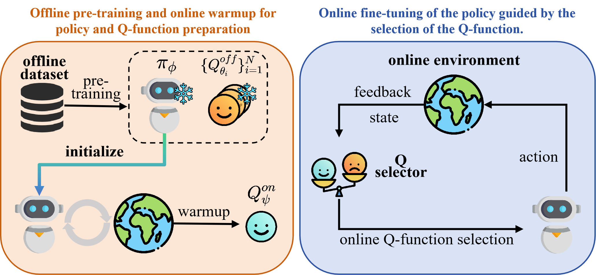

# ENHANCING ONLINE RL FINE-TUNING VIA ADAPTIVE Q-FUNCTION SELECTION
## Method

# Installation
```bash
pip install -r requirements.txt
```
# Train
```bash
python algorithms/AQS.py --config_path=configs/D4RL/walker2d/random_v2.yaml
```
